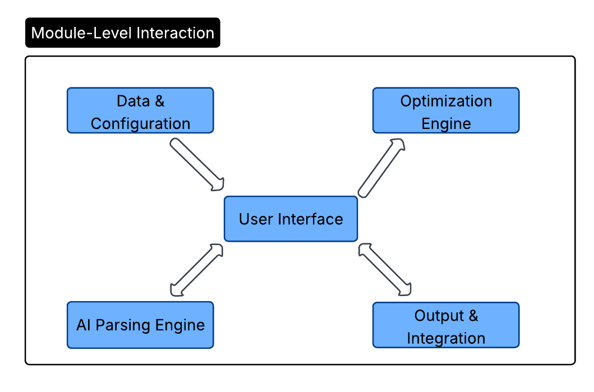
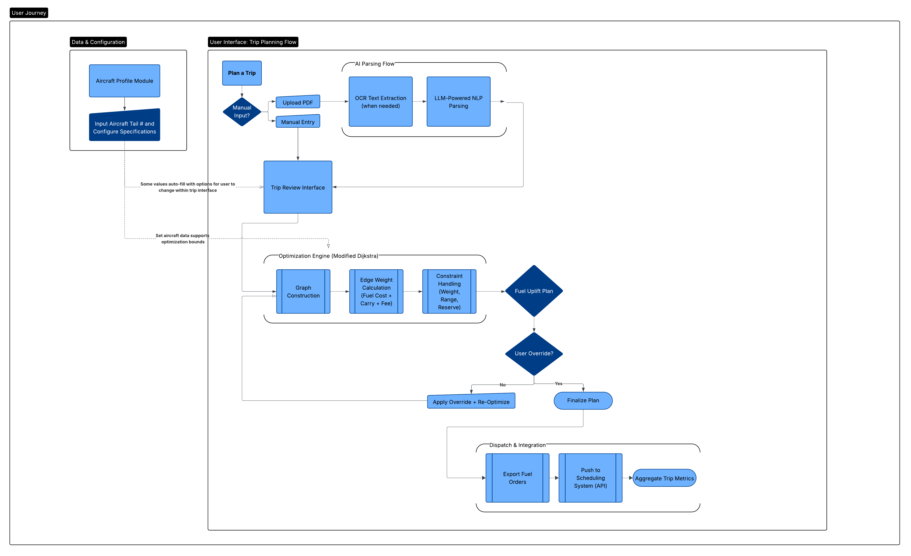
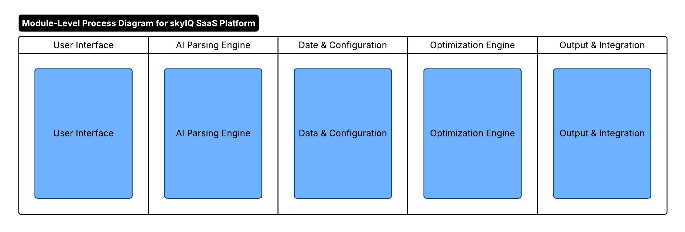
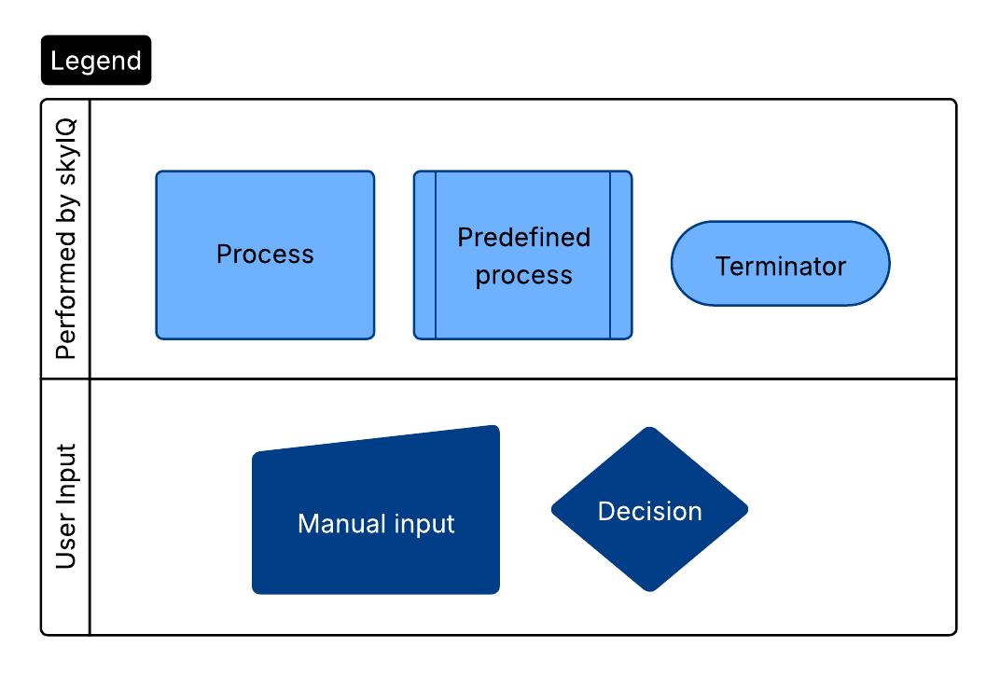
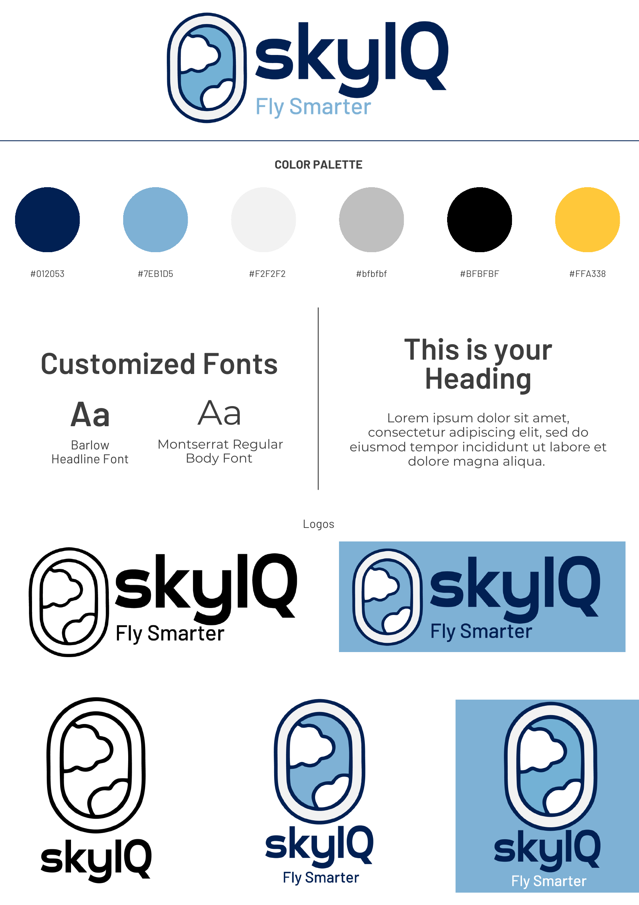
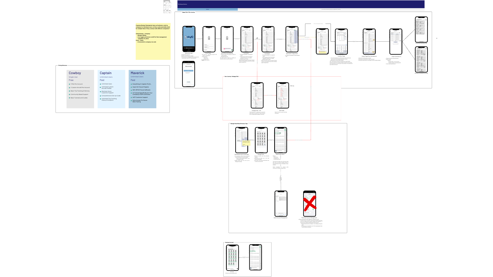
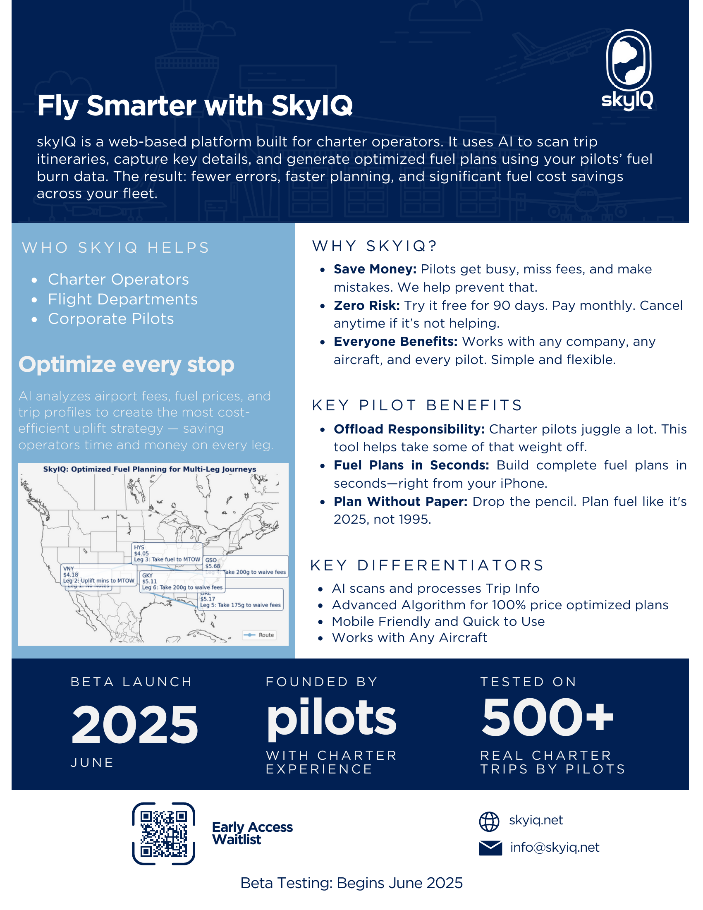

  

# SkyIQ

**Fuel planning & optimization platform for Part 135 aviation operators**

**Patent Pending (19 claims, USPTO) · Trademark Pending**

---

> **My Role:** Co-Founder — Product, Architecture & Design. I own the product vision, system architecture, brand, UX, and go-to-market. My co-founder built the core fuel planning logic and optimization algorithms.

---

## The Problem

Part 135 charter and cargo operators make fuel purchasing decisions based on habit and guesswork. Nobody is optimizing fuel stops against route efficiency, aircraft performance, and real-time pricing — even though fuel is typically the single largest variable operating cost. Operators overpay by thousands of dollars per trip, every trip.

## The Solution

SkyIQ combines real-time fuel pricing, aircraft performance specs, route analysis, and predictive modeling to recommend the most cost-efficient fueling strategy for every flight.

---

## Product Architecture

I designed the system as independent, loosely coupled modules from day one — so fuel pricing sources, aircraft specs, and weather APIs can evolve without requiring a rewrite.

  

The core workflow: a dispatcher uploads a PDF itinerary or enters trip details manually. AI parses the data automatically. The system pulls real-time fuel pricing and aircraft performance data, runs optimization through a modified Dijkstra's algorithm, and outputs a cost-ranked fueling plan.

  

<strong>Module-level processes & legend</strong>

 

  

  

---

## How It Works

**AI-Powered Itinerary Parsing:** Upload a PDF itinerary and the system extracts airports, legs, passengers, weights, and fuel prices automatically — eliminating manual data entry from dispatch workflows.

**Optimization Engine (Modified Dijkstra's):** My co-founder developed the core logic in Python. The algorithm finds the lowest-cost fueling strategy across all viable stop combinations, factoring in real-time pricing, aircraft burn rates, range/payload constraints, and fee structures.

---

## Brand & Design

I designed everything visual about SkyIQ — logo, color system, typography, wireframes, marketing materials, and pitch collateral. Every touchpoint was built to communicate precision and trust (critical in aviation).

  

<strong>Wireframes & one-pager</strong>

 

  

  

---

## Product Thinking

- **Domain expertise drove everything** — my Part 135 background (dispatch, cargo planning through OnFly Air) meant every decision was informed by real operator workflows.
- **Proved the math first** — co-founder built the optimization algorithm in Python before any UI work. I defined requirements and constraints. Validated real savings existed before building the full platform.
- **Trust through transparency** — dispatchers see exactly why SkyIQ recommends a fuel stop, what alternatives cost, and what assumptions the model makes. No black boxes.

---

## Tech Stack

Python (optimization) · AI-powered PDF parsing · Web-based SaaS · Real-time fuel pricing integration · Aircraft performance database · Modular architecture

---

*Built by [Paige Miller](https://github.com/paige-millz) — Co-Founder, Product & Design*
